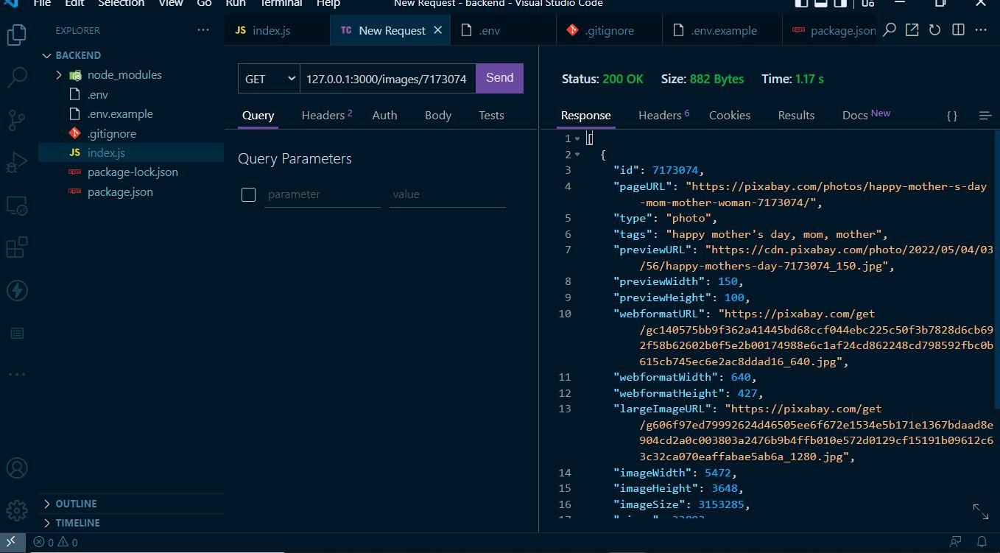

# App Backend

# App frontend

## Backend server

Run `npm start` for a dev server. The api runs on  `http://localhost:8000/`. The server fetches the images from Pixabay

## Backend endpoints
## fetch all
`http://localhost:8000/images`

## show
`http://localhost:8000/images/{id}`

## Front end
